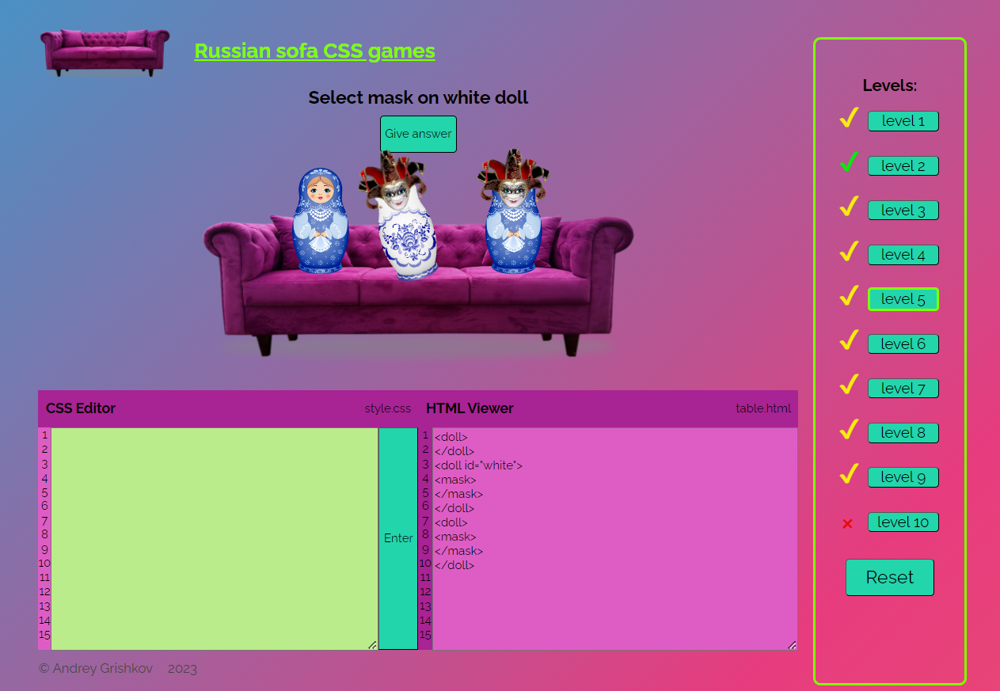
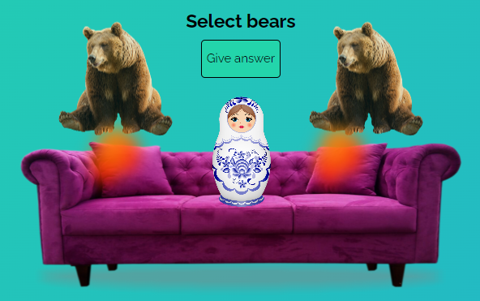

##Russian sofa CSS games
___

### 🪆 Ссылка на проект:

* [Деплой проекта "Russian sofa CSS games"](https://пока-нету/)
___

### 🎭 О проекте "Russian sofa CSS games"

Проект представляет собой аналог игры популярной у начинающих разработчиков:
["CSS Diner"](https://flukeout.github.io/).   
Версия игры написана для закрепления полученных навыков работы с TypeScript и с методологией ООП.
В перработанном дизайне использованы стериотипы о России, которые призваны добавить легкий флер юмора в наш
непростой мир и не призваны кого-либо оскорбить.


*Игровое поле*
___

### 🎲 Правила игры

Цель игры угадывать CSS селекторы для обращения к необходимому Html тэгу.
В игре 10 уровней, с каждым уровнем растет сложность игры. 
На игровом поле под названием игры написано задание текущего уровня черными буквами.
Под заданием расположена кнопка подсказки "Give ansver", если на нее нажать, то ответ автоматически заполниться в поле ввода.
Ниже по центру размещается диван, на котором расположены фигуры.
Фигуры сочетаются с наименованием Html тэгов, а тэг, к которому следует обратиться,
изображен анимированной качающейся фигурой.
Ниже дивана располагается два поля - слева поле ввода ответа, а справа разметка Html.
В поле ввода пользователь вписывает ответ согласно заданию текущего уровня, ориентируясь на разметку справа.
Необходимо выбрать только требуемый тэг, не обращаясь к другим тегам в разметке Html.
После ввода нажимается кнопка Enter справа от поля ввода (также можно нажать клавишу "Enter").
Если ответ верный, то пользователь переходит на следующий уровень, если ответ неверный, то
это отмечается анимацией, и тогда можно попробовать ввести другой ответ или воспользоваться подсказкой.


*Анимация правильного ответа*

В правом углу экрана находиться панель со списком уровней. Крестиком обозначены не пройденные уровни, галочкой обозначены пройденные -
зеленой пройденные самостоятельно, а желтой - с подсказкой. Можно переключиться на ранее пройденные уровни.
Прогресс для пользователя сохраняется. Внизу списка находиться кнопка "Reset", которая позволяет сбросить прогресс
и начать прохождение сначала.

### 💎️ Планы по развитию проекта:
* Добавить подсветку Html кода.
* Переработать анимацию подсказки, сделав расчет длины ответа.
* Менять подсказку при переключении уровня.
* Сделать рефакторинг кода.
* Сделать адаптивную верстку.
* Проработать плавную загрузку всей страницы.
* Добавить уровни.
* Проработать существующие уровни и сделать возможным несколько вариантов ответа.
___

### 🎮  Технологии
*Html, SCSS, BEM, Git, Webpack, TypeScript*


   


### 🛋️ Инструкция по запуску на локальной машине:
* Установить [Node.js](https://nodejs.org/ru/)
* Клонировать репозиторий ``` git clone 'ссылка на репозиторий'```
* Установить зависимости ``` npm install ```
* Запустить приложение ``` npm run dev ```
